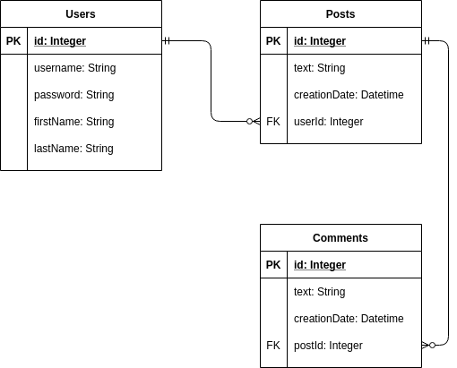

# Java EE Project

## Story 📔

I needed to build simple web app based on JavaEE technologies: Java Servlets, Data Beans, Form Beans, DAO, jsp, jstl.

## Requirements 📑

Requirements are [here](requirements.pdf)

We are requested to build an app, where users could sign-up/sign-in, post messages on theirs' page and comment others' posts

## Database 💾

Schema is simple and straightforward:

