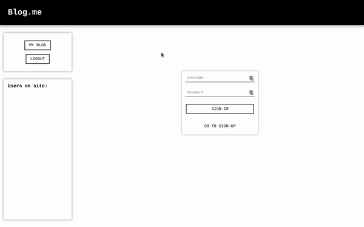
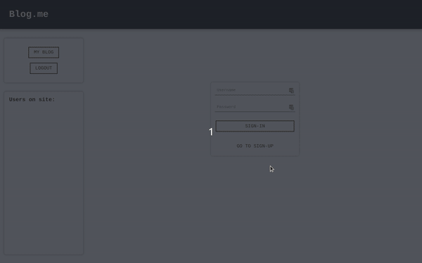
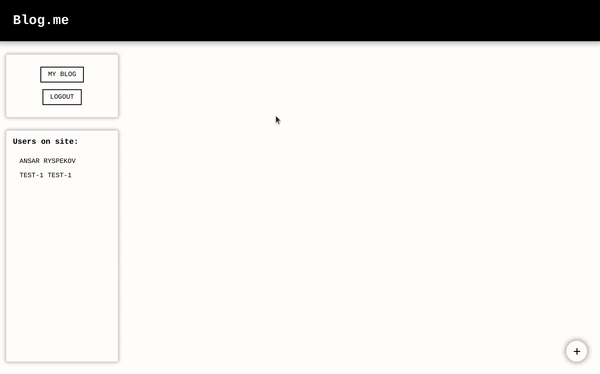
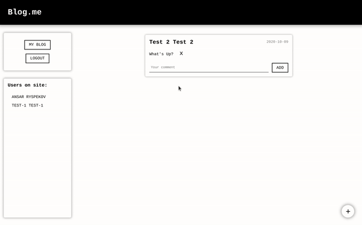
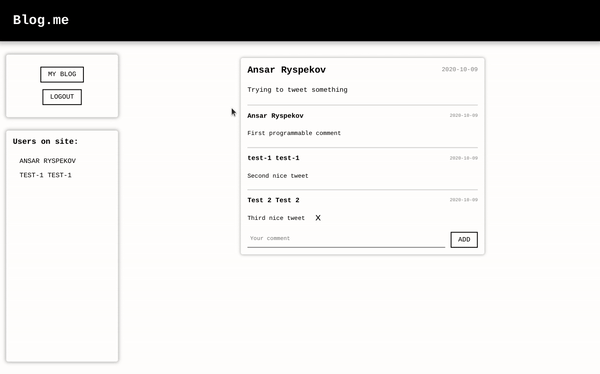

# Java EE Project

## Story 📔

I needed to build simple web app based on JavaEE technologies: Java Servlets, Data Beans, Form Beans, DAO, jsp, jstl.

It was done roughly in three days: 1 day spent on learning the technologies and other two for the implementation. Overall it was a quite new experience to me (In Java world I did Spring Boot previously) and I personally loved working with maven.

## Requirements 📑

Requirements are [here](requirements.pdf)

We are requested to build an app, where users could sign-up/sign-in, post messages on theirs' page and comment others' posts

## Database 💾

Schema is simple and straightforward:


## Instructions

### Installation prerequisites:

- Java 1.8 or higher
- Maven 3.3+
- Running apache tomcat server 8.5+
- Running MySql database

### Configuration

Due to the lack of time, I hardcoded the configuration data, so please perform the following:

1. In `pom.xml` file, change username and password for automatic war deployment (optional)

```xml
<!-- Replace with your values -->
<username>admin</username>
<password>super_secret</password>
```

2. In `src/main/java/practice/services/DatabaseService.java` replace connection string info

```Java
// Replace with your values
String dbURL = "jdbc:mysql://localhost:3306/";
String dbName = "java_ee_project";
String dbUsername = "raydarar";
String dbPassword = "super_secret";
```

### Preparing database

Simply run the script: `misc/db.sql`

### Running the app

Run the following: `mvn clean && mvn install && mvn tomcat7:redeploy`

> Omit the last command if you haven't configured username and password for tomcat deployment

By default, the app should now be started at your localhost, port 8080

## Demo

Here's a little demo to the project

### Starting window

Observing the interface, clicking around



### Sign-Up

Trying to register a new account. Note, there cannot exists two accounts with the same username, so it's unique



### Posting

Let's post something!



### Leaving Comments

How about leaving a comment at someone else's page?



### Ending

Let's wrap everything up and login as different user


